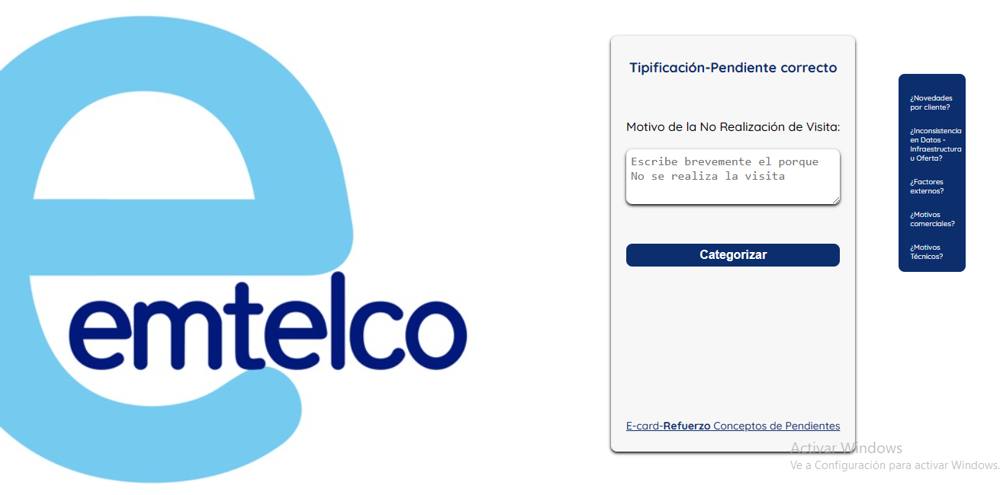

# Conceptos-de-pendientes-Emt :star:
*Herramienta de software para aplicar pendiente correspondiente al incumplimiento de la visita técnica cuando se presenta novedad por cliente, alguna inconsistencia en Datos – Infraestructura u Oferta, factores externos, motivos comerciales, motivos técnico. * 

https://jamquelet.github.io/Conceptos-de-pendientes-Emt/
